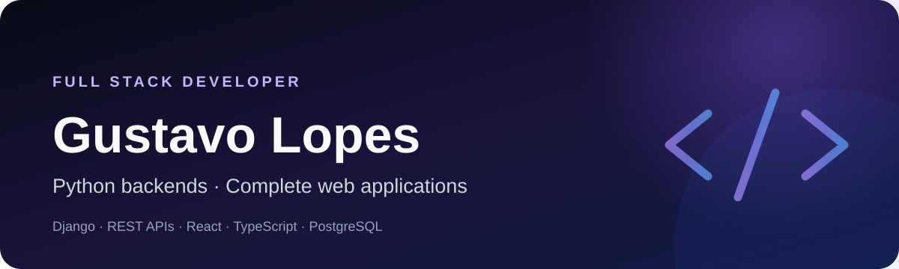

  

  
  

## Sobre mim

Sou desenvolvedor Full Stack com foco em **Python, Django e APIs REST**. Transformo requisitos de produto em aplicações web completas, conectando modelagem de dados, regras de autorização, interfaces responsivas, testes e entrega.

Meus projetos recentes incluem uma plataforma automotiva full stack, uma rede social com Django, um marketplace integrado a uma API Node.js e uma experiência de delivery. Em todos eles, procuro deixar decisões, limitações e formas de execução claras para quem avalia o código.

## Stack principal

- **Backend:** Python, Django, Django REST Framework, Node.js e Express
- **Frontend:** React, Next.js, TypeScript, JavaScript, HTML e CSS
- **Dados:** PostgreSQL, Supabase e modelagem relacional
- **Qualidade e entrega:** Pytest, Django TestCase, Playwright, Docker e GitHub Actions

## Projetos selecionados

| Projeto | Destaques | Stack |
|---|---|---|
| [Projeto Garagem](https://github.com/Gustavo-tec0110/ProjetoGaragem) | produto full stack, autenticação, RLS, busca e testes E2E | Next.js, TypeScript, Supabase, Playwright |
| [Pulse](https://github.com/Gustavo-tec0110/pulse-social-network-django) | domínio social, interface server-rendered e API REST | Django, DRF, PostgreSQL, Docker |
| Classic Motors — [API](https://github.com/Gustavo-tec0110/Classicmotors--BACK) e [Web](https://github.com/Gustavo-tec0110/Classicmotors-FRONT) | marketplace automotivo com autenticação, catálogo e administração | Node.js, Express, PostgreSQL, JavaScript |
| MesaLocal — [Código](https://github.com/Gustavo-tec0110/mesalocal) e [Demo](https://mesa-local.netlify.app) | consumo de API, estado global, carrinho e design responsivo | React, Redux Toolkit, Styled Components |
| [Bookstore API](https://github.com/Gustavo-tec0110/bookstore-drf-ebac) | catálogo, pedidos, autenticação e CI com PostgreSQL | Django, DRF, PostgreSQL, Docker |

## Como trabalho

- código simples, testável e documentado;
- segurança e autorização tratadas como parte da arquitetura;
- automação para tornar qualidade e entrega reproduzíveis;
- limitações registradas sem apresentar protótipos como produtos finalizados.

## Objetivo profissional

Busco oportunidades como **Desenvolvedor Full Stack Python**, com espaço para contribuir em backend Django, APIs, bancos relacionais e integração com interfaces modernas.

## Contato

- E-mail: [gustavo.sl.0110@gmail.com](mailto:gustavo.sl.0110@gmail.com)
- GitHub: [@Gustavo-tec0110](https://github.com/Gustavo-tec0110)
