  

  
  
  

## About

Full Stack Developer building end-to-end web products with **Python/Django APIs** and **React, Next.js, TypeScript, and Node.js**.

## Core stack

### 01 — Languages & foundations

### 02 — Frontend

### 03 — Backend & APIs

### 04 — Databases & services

### 05 — DevOps & testing

### 06 — Deployment

## Featured project

### Projeto Garagem

  

> **Featured full-stack product** — a platform for publishing, discovering, and following automotive projects.

An automotive community platform built to make vehicle projects easy to publish and discover.

`Next.js` · `React` · `TypeScript` · `Supabase` · `PostgreSQL` · `Playwright`

**[Live demo ↗](https://projetogaragem.netlify.app)** &nbsp;·&nbsp; **[Repository ↗](https://github.com/Gustavo-tec0110/ProjetoGaragem)**

Engineering highlights

- Server-side authentication and authorization backed by PostgreSQL Row Level Security.
- Project publishing with images, personal garages, saved projects, likes, comments, follows, and notifications.
- Versioned database migrations plus public and authenticated end-to-end flows for desktop and mobile viewports.
- Explicit local demo fallback so the interface remains reviewable without database credentials.

## Other projects

<table>
  <tr>
    <td width="33.33%" valign="top">
      <h3><a href="https://github.com/Gustavo-tec0110/pulse-social-network-django">Pulse</a></h3>
      
Social network and REST API for profiles, feeds, relationships, and conversations.

      
<code>Python</code> · <code>Django</code> · <code>DRF</code> · <code>PostgreSQL</code>

      <a href="https://github.com/Gustavo-tec0110/pulse-social-network-django">Repository ↗</a>
    </td>
    <td width="33.33%" valign="top">
      <h3>Classic Motors</h3>
      
Automotive marketplace with a searchable catalog and administration workflow.

      
<code>Node.js</code> · <code>Express</code> · <code>PostgreSQL</code> · <code>Cloudinary</code>

      <a href="https://github.com/Gustavo-tec0110/Classicmotors--BACK">API ↗</a> · <a href="https://github.com/Gustavo-tec0110/Classicmotors-FRONT">Web client ↗</a>
    </td>
    <td width="33.33%" valign="top">
      <h3><a href="https://github.com/Gustavo-tec0110/bookstore-drf-ebac">Bookstore API</a></h3>
      
REST API for a bookstore catalog and authenticated customer orders.

      
<code>Python</code> · <code>Django REST Framework</code> · <code>PostgreSQL</code> · <code>Docker</code>

      <a href="https://github.com/Gustavo-tec0110/bookstore-drf-ebac">Repository ↗</a> · <a href="https://bookstore-drf-ebac.onrender.com/health/">Health ↗</a>
    </td>
  </tr>
</table>

## Contribution activity

  

Generated from GitHub's public contribution calendar and refreshed daily.

## Background

**Education** — EBAC · Python Full Stack Developer (completed)

**Current focus** — Projeto Garagem · Python/Django backends · complete web products · remote full-stack, backend, and Python opportunities

## Connect

[Email](mailto:gustavo.sl.0110@gmail.com) &nbsp;·&nbsp; [GitHub](https://github.com/Gustavo-tec0110) &nbsp;·&nbsp; [LinkedIn](https://www.linkedin.com/in/gustavo-silva-lopes-dev/)
